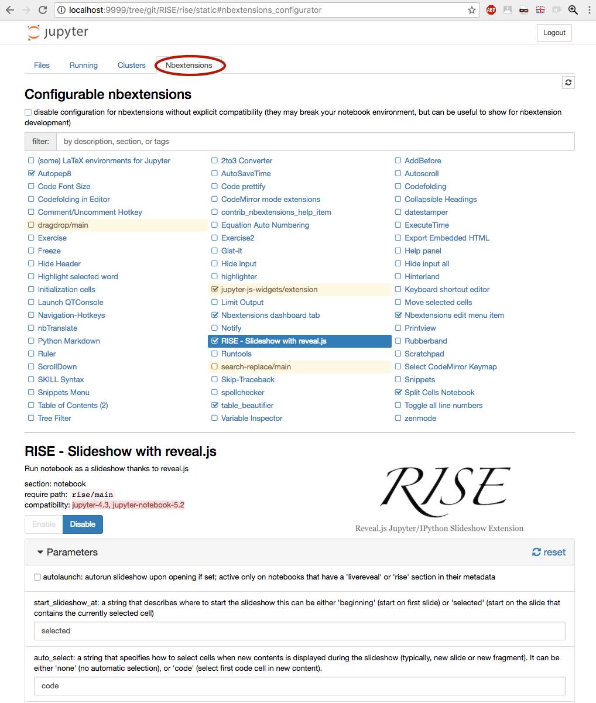
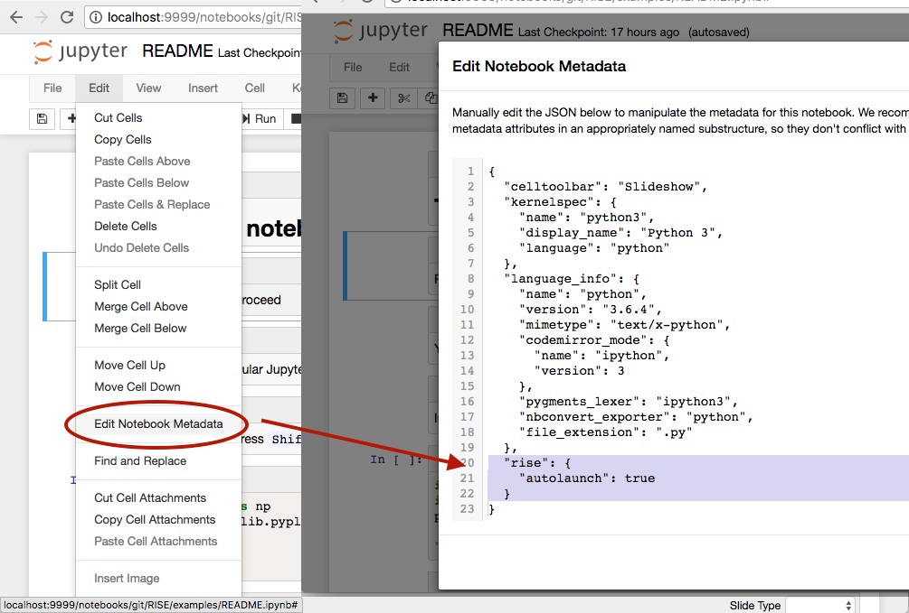

Customizing RISE
================

What to configure
-----------------

Here's a list of things that can be customized. [See below for more
details](#how-to-customize) on how to implement those settings.

* [presentation theme](#choosing-a-theme)
* [transiton between slides ](#choosing-a-transition)
* [auto-launch presentation mode](#automatically-launch-rise)
* [where to start the presentation](#choosing-where-the-slideshow-begins)
* [automatic selection of cells](#select-cells-based-on-the-current-slide)
* [slide sizes](#change-the-width-and-height-of-slides)
* [decoration (header/footer/background)](#decorating-all-slides)
* [vertical scrollbar](#enable-a-right-scroll-bar)
* [using a leap motion controller](#usage-with-leap-motion)
* [native `reveal.js` settings](#reveal-js-configuration-options)
* [custom CSS](#adding-custom-css)
* [keyboard shortcuts](#keyboard-shortcuts-and-jupyter-actions)
* [changing the toolbar icon](#toolbar-icon)

### Choosing a theme

You can configure the `theme` of your presentation (which controls the
general look and feel of the presentation) with:

    {
     ...
     "rise": {"theme": "sky"}
    }

### Choosing a transition

The transition configuration defines what happens in between slides:

    {
     ...
     "rise": {"transition": "zoom"}
    }

### Automatically launch RISE

You can setup your notebook to start immediately with the slideshow
view using the `autolaunch` config option. This typically is very
helpful if you plan on publishing slideshows through something like
`mybinder.org`:


    {
     ...
     "rise": {"autolaunch": true}
    }


### Choosing where the slideshow begins

The following configure changes where the slides begin. By default, RISE
will start at the selected slide. To have it start at the first slide
instead, use the following configuration:

    {
     ...
     "rise": {"start_slideshow_at": "beginning"}
    }

### Select cells based on the current slide

As you progress into your slideshow, you either move to a new
(sub)slide, or show (or hide) a new fragment; whenever any of these
events occur, you may wish to have the jupyter selection keep in sync or
not; this is the purpose of the auto-select feature.

There are currently two settings that let you change the way auto-select
behaves, here are their default values:

    {
     ...
     "rise": {"auto_select": "code",
              "auto_select_fragment": true}
    }

`auto_select` can be any of:

-   `code` (the first code cell is auto-selected)
-   `none` (no auto-selection)
-   `first` (the first cell is auto-selected)

`auto_select_fragment` is a boolean that states whether auto-selection
should select cells based on the current slide as a whole (when set to
`false`) or restrict to the current fragment (when set to `true`, the
default).

**These settings are experimental and may change in the future**;
hopefully the current default behaviour is just fine. We might remove
`auto_select_fragment` as a setting altogether; we might also turn
`auto_select` into a mere boolean, since the current setting
`auto_select = "first"` has not proved of any practical value.
Regardless, it seems like the most meaningful combinations as of now
are either `auto_select = "none"` - in which case the other setting is
ignored, or `auto_select = "code"` and `auto_select_fragment = true`,
which now is the default.

### Change the width and height of slides

To control the width and height of your slides, use the following
configuration:

    {
     ...
     "rise": {"width": "90%",
              "height": "90%"}
    }

**Important notes**

* remember that you can always use your browser's shortcuts to zoom
in/out (`Cmd/Ctrl +` and `Cmd/Ctrl -`), and this way adjust the slide
content to your screen/projector size.

* this method is *often preferable* than setting sizes. In particular
  it is dangerous to set sizes in pixels, as most often you cannot
  rehearse with the actual projector. We recommend setting relative
  sizes (in percents) rather than absolute ones (in `px` or `cm`).

* in any case you may want to increase the slide height to ensure that
cell outputs fit within a single slide; keep in mind that cell
contents tend to take more space as you run your code.

### Decorating all slides

RISE offers two levels for inserting a static background. You can either

* define `overlay`, in which case you take full control,
* **or** you can define `header`, `footer` and `backimage`.

So if you define `overlay`, the 3 latter options will be ignored.


#### `overlay`

It is possible to add the config option `overlay` to build a constant
background.  It is wrapped in a`<div>`, so it can be text or html.  In
this case, the user is entirely responsible for styling.  For example:

    {
     ...
     "rise": {
         "overlay": "<div class='myheader'><h2>my company</h2></div><div class='myfooter'><h2>the date</h2></div>"
     }
    }

#### `header`, `footer` and `backimage`

As a more limited, but often more convenient alternative, you can
define any of the following 3 settings.

In this case, minimal styling is applied (floor and ceiling), but user
is still responsible for cosmetic styling:

    {
     ...
     "rise": {
         "backimage": "mybackimage.png",
         "header": "<h1>Hello</h1>",
         "footer": "<h3>World!</h3>"
     }
    }

You can see some examples using these options at
`RISE/examples/overlay.ipynb` and
`RISE/examples/header-footer.ipynb``, or in binder respectively
[](https://mybinder.org/v2/gh/parmentelat/RISE.git/doc2?filepath=examples%2Foverlay.ipynb)
[](https://mybinder.org/v2/gh/parmentelat/RISE.git/doc2?filepath=examples%2Fheader-footer.ipynb)


### `toolbar_icon`

You can chose the name of a `font-awesome` icon to be used for RISE's toolbar button.

    {
     ...
     "rise": {"toolbar_icon": "bar-chart"}
    }

### Enable a right scroll bar

To enable a right scroll bar when your content exceeds the slide vertical height,
use the following configuration:

    {
     ...
     "rise": {"scroll": true}
    }

### Usage with Leap Motion

**Reveal.js** supports the [Leap Motion](https://www.leapmotion.com) controller.
To control RISE slides with the Leap, put the
[reveal leap plugin options](https://github.com/hakimel/reveal.js#leap-motion)
in your config with the following parameters:

    {
     ...
     "rise": {
         "leap_motion": {
            "naturalSwipe"  : true,     # Invert swipe gestures
            "pointerOpacity": 0.5,      # Set pointer opacity to 0.5
            "pointerColor"  : "#d80000" # Red pointer"nat.png"
            }
        }
    }

To disable it:

    {
     ...
     "rise": {
         "leap_motion": "none"
     }
    }

### `reveal.js` configuration options

`reveal.js` offers a few configuration of its own, [as described in
`reveal.js`'s documentation](https://github.com/hakimel/reveal.js). Out of this
category, RISE will pass through the following settings:

* `controls` to enable or disable the left hand side icon buttons
  (help and exit)

* `progress` to enable or disable the thin progress bar at the bottom
  of the slideshow

* `slideNumber` that allows you to turn off, or customize, slide
  numbers. Set to boolean `false` to turn off, [see `reveal.js`'s doc
  for more details](https://github.com/hakimel/reveal.js#slide-number)

* as well as `history` and `minScale`.

**Note**: The use of the `minScale` option (values other then`1.0`)
  can cause problems with codemirror.

### Adding custom CSS

RISE looks for two css files to apply CSS changes on top of the
slideshow view:

* First, it attemps to load `rise.css`, and hence this will be
applied to all notebooks in the current directory;

* Second, it attempts to load `the_notebook_name.css` and so this will
hence be only applied to `the_notebook_name.ipynb`.

Both files need to be placed alongside with the notebook of interest,
i.e. in the same directory.  You can see some examples using this
customization with `RISE/examples/showflow.ipynb`.

How to customize
----------------

RISE can be customized in a lot of ways. As of RISE version 5.3, you can:

1. use `nbextensions_configurator`; this tool offers an interactive
   way to enable, disable and tweak all notebook extensions - see
   screenshot below;

1. you can also embed settings in a specific notebook's metadata;

1. and you can also provide your own css file(s), that can supersede
   styling of the various DOM pieces.

### The configurator

You may need to install a separate module:

    pip3 install jupyter-nbextensions-configurator

You should then see a fourth tab in jupyter's directory views, as
depicted below. Settings are stored in JSON format, typically in

    ~/.jupyter/nbconfig/notebook.json




### Notebook metadata

These settings can also be stored in your notebook metadata, which
holds a JSON object, that can be edited through Jupyter's standard
menu (Edit → Edit Notebook Metadata); typically it would look like
this:

    {
        ...
        "rise": {
            "theme": "serif",
            "transition": "zoom",
            ...
        },
        ...
    }
You can edit notebook metadata as follows



### Note on legacy naming

In all this document we store settings in a JSON key named `rise`.
You may also see some notebooks using the `livereveal` key instead,
which is an older name for the same project. Both names are actually
taken into account, however you should know that `rise` will take
precedence on `livereveal` if the same setting in defined under both
names.

### Order of precedence

If we forget about custom CSS for now, that is to say as far as the
first 2 categories are concerned: at this point you need to be aware
that:

* settings changed through the configurator - or using python as we
  will see below - are stored on your own file system, typically in
  your home directory, and so are only be applicable to you;

* *a contrario* settings embedded in a specific notebook's metadata
   will be applicable to all users, even if they end up in a mybinder
   instance.

Apart from that, the scope of what is configurable through both
channels (configurator and metadata) is identical, so it is possible
to use the configurator as some sort of an online reference manual,
as it describes each and every setting.

Finally, the following priorities apply:

* a setting will always be used if you define it in the `rise` section
  of the nodebook metadata;

* if not, it will be used if it is present in the legacy `livereveal`
  (see below) section of the notebook metadata;

* then if not, the settings from your own profile (either defined
  through the configurator, or through python) are applied.

### Using python

As an alternative way to tweak your local user's settings with a
script rather than from the configurator, you can use python like show
in this example that leverages the JSON config manager from
`traitlets`:

```python
from traitlets.config.manager import BaseJSONConfigManager
path = "/home/damian/miniconda3/envs/rise_latest/etc/jupyter/nbconfig"
cm = BaseJSONConfigManager(config_dir=path)
cm.update("rise", {
              "theme": "sky",
              "transition": "zoom",
              "start_slideshow_at": "selected",
})
```

**Notes:**

* `path` is where the `nbconfig` is located. This will vary depending
  on where you "installed" and "enabled" the nbextension.

* you can use `jupyter --paths` to see the path locations that are
  applicable.

* for more information, see these docs:
  * <http://jupyter.readthedocs.io/en/latest/projects/jupyter-directories.html>
  * <http://jupyter-notebook.readthedocs.io/en/latest/frontend_config.html>.


## Keyboard shortcuts and Jupyter actions

Here are the Jupyter actions registered by RISE:

    action name             key      behaviour
    ------------------------------------------------------
    RISE:slideshow         alt-r  enter/exit RISE Slideshow
    RISE:smart-exec               execute cell, move to the next if on same slide
    RISE:toggle-slide     shift-i (un)set current cell as a Slide cell
    RISE:toggle-subslide  shift-u (un)set current cell as a Sub-slide cell
    RISE:toggle-fragment  shift-f (un)set current cell as a Fragment cell
    RISE:toggle-note              (un)set current cell as a Note cell
    RISE:toggle-skip              (un)set current cell as a Skip cell
    RISE:render-all-cells         render all cells (all cells go to command mode)
    RISE:edit-all-cells           edit all cells (all cells go to edit mode)

Some, but not all, come bound to default keyboard shortcuts. There are
2 ways you can change the bindings

### Through JSON

Like the other settings described in this section, you can define
shortcuts in JSON with e.g.

    {
     ...
     "rise": {
         "shortcuts": {
             "slideshow": "alt-a",
             "edit-all-cells": "ctrl-e"
         }
    }

With the above settings, RISE would **not** bind the default `Alt-R`
key to `RISE:slideshow`, but it would bind `Alt-A` instead. It would
also bind `RISE:edit-all-cells` to `Ctrl-e`.

### Through `custom.js`

You can also use these actions in some regular javascript code,
typically your `~/.jupyter/custom/custom.js`. Here is an example that
will attach one of these actions to a custom keyboard shortcut:

```javascript
    define(
        ['base/js/namespace'],
        function(Jupyter) {

            let command_shortcuts = Jupyter.keyboard_manager.command_shortcuts;

            // set / unset the 'Slide' tag in slideshow metadata
            command_shortcuts.set_shortcut(
                'alt-a', 'RISE:slideshow');
        })
```

Note that with this approach, you will end up with the
`RISE:slideshow` action bound to **both** `Alt-R` and `Alt-A`.


### Keyboard shortcut editors

The actions exposed to Jupyter are also present in Jupyter's
mainstream keyboard shortcuts editor, that you can use to (un)define
your custom shortcuts.
